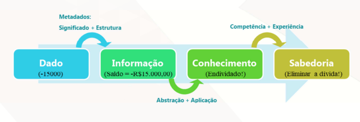

# Monitoria (01) - 14/02
Disciplina: Modelagem Informacional<br>
Professor: Júlio César Chaves<br>
Monitor: Gianlucca Devigili.

> Slides das aulas: [aula 01](https://ss.cursos.fgv.br/d2l/le/content/121047/viewContent/1506500/View) | [aula 02](https://ss.cursos.fgv.br/d2l/le/content/121047/viewContent/1511634/View) _(os links exigem estar logado no eclass)_

## A2Q2

```
❓ Cite um exemplo, ou descreva um caso, em que o conhecimento prévio de metadado ajudou você a resolver um problema, ou poderia ter ajudado se você soubesse antes.
```

Resposta pessoal. Pode ser um exemplo mais “concreto”, como o do apartamento ou o da rua que estão nos slides, ou então um exemplo mais “técnico”, como quando você usou um banco de dados/dataset e o metadado sobre os seus dados lhe ajudou de alguma forma.

## A2Q4

```
❓ Complete a sentença:
Normalmente, o desenvolvimento de um sistema de banco de dados inicia na etapa de ___________________________ _____________________________.
(a) “requisitos de negócio e termina na etapa de uso do banco de dados”
(b) “requisitos de banco de dados e termina se o negócio deixar de existir”
(c) “requisitos de banco de dados e termina no uso do banco de dados”
(d) “requisitos de negócio e termina se o negócio deixar de existir”
(e) “requisitos de negócio e termina na administração dos bancos de dados”
````

Pense qual o primeiro passo do desenvolvimento: elicitar os requisitos do banco ou os requisitos de negócio? Você consegue definir os requisitos de negócio sem os requisitos de banco de dados? E os requisitos do banco de dados, é possível definí-los sem os requisitos de negócio?

E desenvolvimento termina quando? Após o *deploy,* quando ele começa a ser usado? Na etapa de administração do mesmo? Ou então ele para de ser desenvolvido apenas após o banco deixar de ser usado e o negócio ter acabado?

(Dica: a resposta da questão 8 pode ajudar a encontrar a resposta da segunda).

## A2Q6 Dado vs. Metadado

```
❓ Crie seu próprio exemplo de um conjunto de dados, primeiro sem metadado e depois com metadado.
```


**Dado** = uma informação.<br>
por exemplo: “miojo”, “galinha caipira”, 3 ou 1.50.

**Metadado** = dado que descreve o dado ou seja, uma informação sobre o dado. <br>
Metadados sobre os dados acima: “miojo” é o nome do produto, 3 o tempo de preparo e 1.50 é o preço dele. 

## Exemplo da aula:

Dado: `612`

Metadado: `apartamento 612`

um metadado mais detalhado seria que o apartamento `612` é o décimo segundo (12) apartamento do sexto (6) andar. O metadado aqui é que o primeiro dígito representa o andar e os dois últimos dígitos o número do apartamento.

Outro exemplo é este diagrama:



note que `-15000` pode ser qualquer coisa,  mas quando temos a **informação** de que estes `-15000` representam um `saldo bancário`, você consegue entender melhor o dado por conta de seu **metadado** (o dado do dado).

> Também poderíamos especificar mais os dados, adicionando informações como tipo (ex.: varchar(45), decimal(10,2), char, bool, etc.), quanto armazenamento ele ocupa, a tabela na qual ele está armazenado no banco, etc. Mas isso já é mais do que a questão pede.

## A1Q3

```
❓ Cite 3 recursos comuns utilizados na etapa de elicitação de requisitos junto aos usuários finais.
```

Dica: existem mais do que 3.